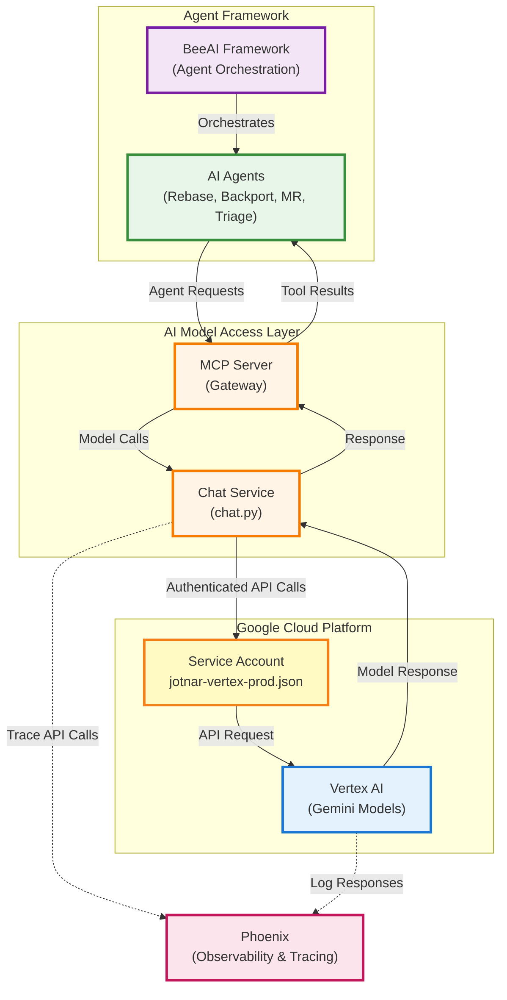
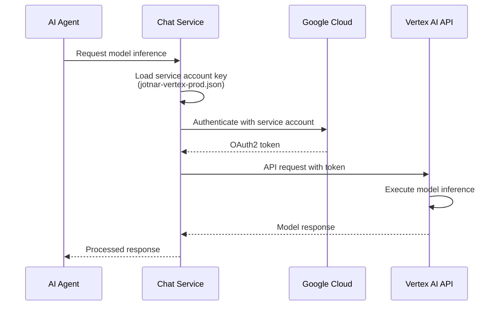
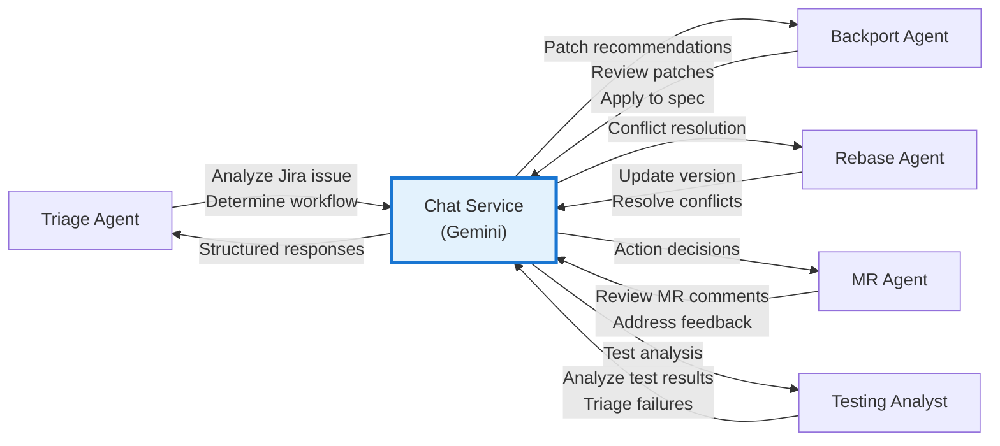

# AI Providers Data Flow

This document describes how the AI Workflows system interacts with AI model providers for automated decision-making and content generation.

## AI Provider Architecture



## Google Cloud Platform Integration

### Service Accounts

| Project | Purpose | API Key Storage |
|---------|---------|-----------------|
| **jotnar-bot** | Production deployment | Bitwarden: `jotnar-vertex-prod.json` |
| **packit-automated-packaging** | Development and testing | GCP Console |

### Authentication Flow



## AI Model Usage

### Models in Use

**Primary Model:** Gemini (Google Vertex AI)

**Use Cases:**
- Spec file analysis and modification
- Patch backporting and application
- Build failure diagnosis and fixing
- Test result analysis
- Jira issue triage
- Merge request review

### Agent-to-Model Communication



## Configuration

### Environment Variables

**Chat Service Configuration:**
```bash
# Model selection
CHAT_MODEL=gemini-1.5-pro

# API credentials
GOOGLE_APPLICATION_CREDENTIALS=/etc/secrets/jotnar-vertex-prod.json

# Model parameters
MAX_RETRIES=3
TEMPERATURE=0.7
```

**Agent Configuration:**
```bash
# BeeAI framework settings
BEEAI_MAX_ITERATIONS=10
BEEAI_TIMEOUT=300
```

### OpenShift Configuration

**Secrets:**
- `vertex-key` - Contains `jotnar-vertex-prod.json` service account key

**ConfigMaps:**
- `chat-env` - Chat model configuration
- `agents-env` - Agent-specific model parameters

---

**Last Updated:** 2026-03-03
