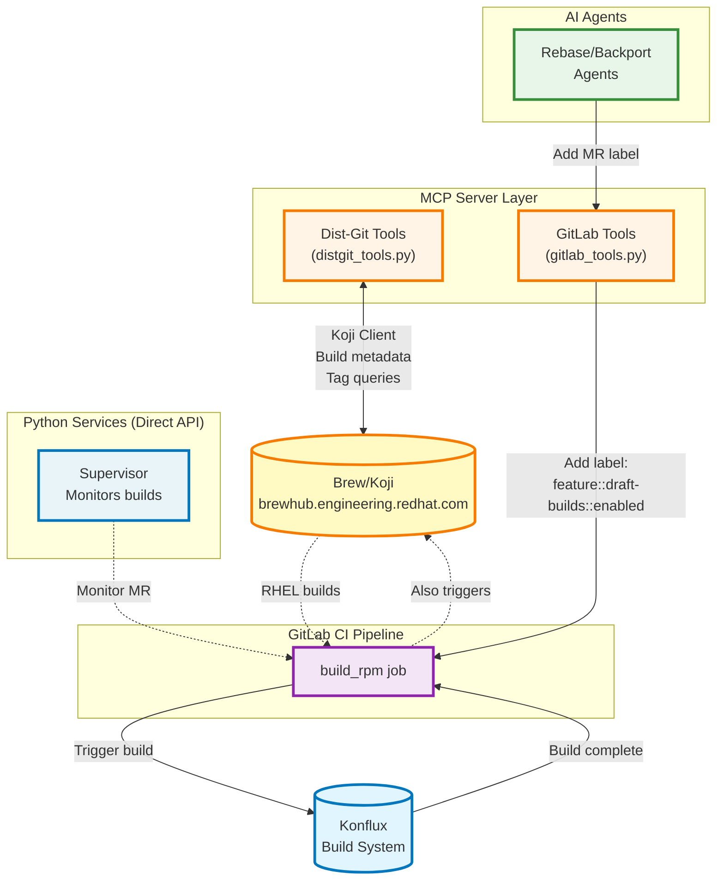
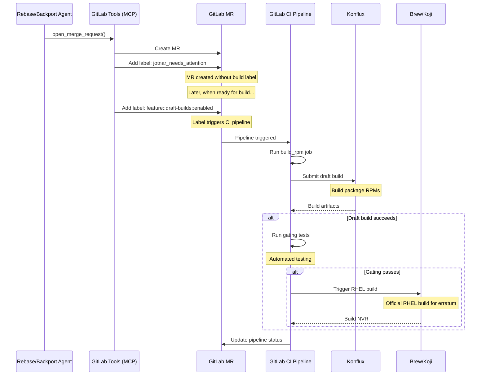
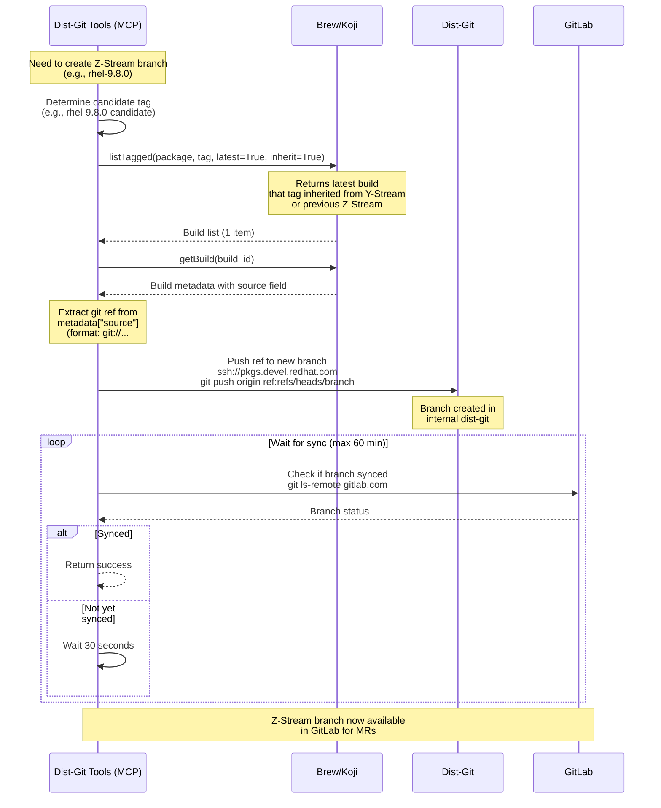
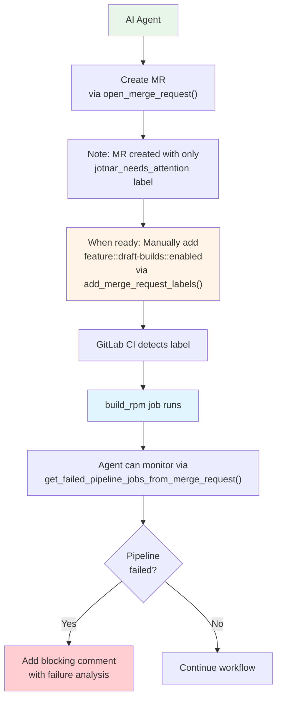

# Brew/Konflux Build System Data Flow

This document describes how the AI Workflows system interacts with Brew (Koji) and Konflux for RHEL package builds.

## System Architecture



## Build Trigger Flow



## MR Labels

| Label | Applied By | Purpose | Effect |
|-------|------------|---------|--------|
| **feature::draft-builds::enabled** | Manual (when ready for build) | Enable Konflux draft builds | Triggers build_rpm CI job |
| **target::latest** | GitLab CI (auto) | Y-stream build target | Builds for latest minor version (rhel-X-main) |
| **target::zstream** | GitLab CI (auto) | Z-stream build target | Builds for specific minor version (rhel-X.Y.0) |
| **target::exception** | Manual | Exception handling | Requires special consultation |

## Brew (Koji) Integration

### Connection Details

**URL:** `https://brewhub.engineering.redhat.com/brewhub`

**Used By:**
- MCP Server (Dist-Git Tools) - For Z-Stream branch creation
- GitLab CI - For official RHEL builds (after draft build passes)

**Authentication:** Kerberos (automatic via system ticket)

### Koji API Operations

| Operation | Purpose | Used By | Returns |
|-----------|---------|---------|---------|
| **listTagged** | Get builds for a specific tag | MCP Dist-Git Tools | List of builds |
| **getBuild** | Get detailed build metadata | MCP Dist-Git Tools | Build info with source ref |

### Z-Stream Branch Creation with Koji



**Why Use Koji?**
- Find the correct base commit for new Z-Stream branches
- Ensures Z-Stream starts from the right build
- Handles cases where higher Z-Streams already exist

## Agent Interaction with Builds

Agents don't directly trigger builds but enable them via MR labels:



## Z-Stream vs Y-Stream Builds

### Y-Stream (target::latest)

- **Branch:** `rhel-X-main`, `c10s`
- **Purpose:** Latest minor version development
- **Build Target:** Latest release
- **Label:** `target::latest` (auto-applied)

### Z-Stream (target::zstream)

- **Branch:** `rhel-X.Y.0`, `c9s` for RHEL 8/9
- **Purpose:** Bug fixes for specific minor version
- **Build Target:** Specific minor release
- **Label:** `target::zstream` (auto-applied)
- **Special:** May need Z-Stream branch creation first

## Authentication & Configuration

### Brew/Koji

**Authentication:** Kerberos ticket (automatic)

**Initialization:**
```python
principal = await init_kerberos_ticket()
# Returns: username@IPA.REDHAT.COM
```

### Konflux

**Authentication:** Handled by GitLab CI service account

**No direct API access** from agents - all interaction via GitLab CI pipeline

---

**Last Updated:** 2026-03-03
