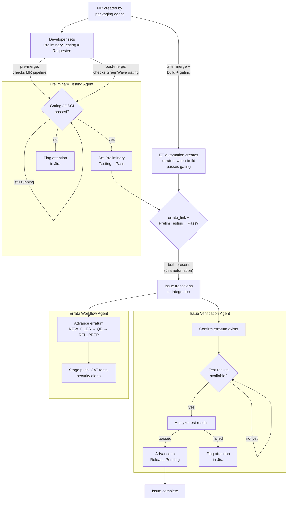
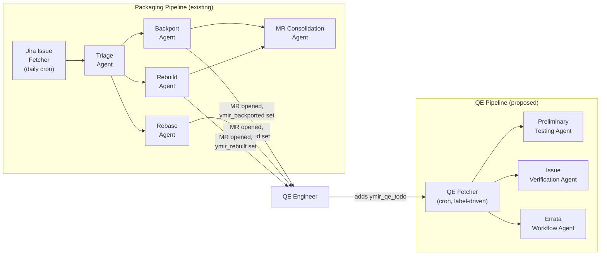

# QE Agents Overview

## Current State

Three QE agents were extracted from the old Supervisor into standalone modules. They are fully independent — no imports from `ymir.supervisor`, use MCP gateway tools, and live under the `agents` compose profile. Each is a **one-shot executor** (takes an env var, processes one item, exits). No trigger mechanism is deployed — they can only be run manually via compose.

The old Supervisor code (`ymir/supervisor/`) is dead code: commented out in `deploy.sh`, not deployed. Source files, OpenShift manifests, Containerfile, CI build job, and Makefile targets still exist in the repo.

| Agent | Source | Input | What it does |
|---|---|---|---|
| **Preliminary Testing** | `ymir/agents/preliminary_testing_agent.py` | `JIRA_ISSUE` | Analyzes GreenWave gating and MR pipeline outcomes. Sets Preliminary Testing to Pass (or flags attention on failure). |
| **Issue Verification** | `ymir/agents/issue_verification_agent.py` | `JIRA_ISSUE` | Post-fix lifecycle: tracks MR merge → erratum creation → analyzes EWA/NEWA test results (posted as ET comments) → advances issue to Release Pending. |
| **Errata Workflow** | `ymir/agents/errata_workflow_agent.py` | `ERRATUM_ID` | Advances errata through ET states: NEW_FILES → QE → REL_PREP. Handles stage push, CAT tests, security alerts, product listing verification. |

Each agent is **self-routing** — it fetches the issue/erratum, checks preconditions, and decides what to do based on the current state. If there's nothing to do, it exits immediately (Jira/ET API check only, no LLM cost).

### Where QE agents fit in the issue lifecycle

The packaging pipeline (triage → backport/rebase/rebuild) produces a merge request. The QE agents cover the lifecycle from that point onward — starting while the MR is still open and continuing through erratum release:

- **Preliminary Testing Agent** — triggered when a developer sets `Preliminary Testing = Requested` on the Jira issue. This can happen in two flows: **pre-merge** (MR is ready for review, agent checks OSCI pipeline results on the MR) or **post-merge** (build exists in the candidate tag, agent checks GreenWave gating). The agent sets the field to Pass or Fail. Separately, Errata Tool automation creates an erratum and attaches the build once it passes internal gating and is tagged with the `rhel-*-candidate` Brew tag. Once both `errata_link` and `Preliminary Testing = Pass` are present, the issue automatically transitions to Integration (via Jira automation).
- **Issue Verification Agent** — runs **post-merge**: once the erratum moves to QE, EWA or NEWA (depending on RHEL version and configuration) runs testing and posts results as ET comments (links to TCMS for EWA, or TF/RP for NEWA). The agent waits for these comments to appear, analyzes the results, and advances the issue to Release Pending
- **Errata Workflow Agent** — runs **post-merge**: advances the erratum itself through Errata Tool states (NEW_FILES → QE → REL_PREP), handling stage push, CAT tests, and security alerts

The Issue Verification and Errata Workflow agents run in parallel on different objects — one tracks the Jira issue, the other tracks the erratum. However, there is a dependency: the Errata Workflow Agent cannot advance the erratum from QE → REL_PREP until all related Jira issues are set to Release Pending by the Issue Verification Agent.

**Preliminary Testing** is effectively a **single-shot check** — when `Preliminary Testing = Requested` is set (the normal trigger), results are typically already available so no waiting is needed. If triggered too early (e.g. human adds `ymir_qe_todo` before pipeline finishes), the agent comments why it can't proceed and exits; the human can re-trigger when ready.

**Issue Verification** and **Errata Workflow** are different — they genuinely need **busy-wait loops** over days/weeks (waiting for MR merge, erratum creation, test results, stage push). These are the agents that benefit most from deployed label-triggering, since the service handles the re-checking automatically.

Currently these agents are **one-shot only** — each must be invoked manually with `make run-<agent>-standalone JIRA_ISSUE=...`. The proposed integration below adds automated triggering via the `ymir_qe_todo` label.

### Future: shift-left to MR testing

**Near-term**: Both Preliminary Testing and Issue Verification agents will be updated to pick up and prefer **MR testing results** (posted to Jira and the MR) alongside the current post-merge ET comment-based results.

**Longer-term**: When testing moves fully to MR (finished by QE approval in the MR), both agents become purely formal steps based on pre-existing MR results. The Preliminary Testing step will be dropped entirely and the Integration status in Jira will be repurposed for RHEL Compose team activities.

### Differences compared to Supervisor worth checking

A few checks from the old Supervisor are not replicated in the standalone agents:

| Missing logic | Old location | Impact |
|---|---|---|
| NEW_FILES guard during issue verification | `issue_handler.py:278-281` | Issue Verification Agent may run LLM testing analysis prematurely (before QE testing begins) |
| Team assignment pre-filter | `collect.py` JQL | Agents process any issue regardless of team assignment |

Note: the old Supervisor's erratum ownership check (`erratum_handler.py:302-313`) is not needed — it was a Jotnar pilot artifact where the bot assigned issues to itself.

## Proposed Integration: `ymir_qe_todo` Label as Enabler

A human adds `ymir_qe_todo` once to enable QE processing. The system shepherds the issue through preliminary testing → issue verification → errata advancement over days/weeks until the lifecycle completes.

### Flow

1. **Human adds `ymir_qe_todo`** to a Jira issue.
2. **QE Fetcher** (CronJob, every ~20 min) picks it up, swaps label to `ymir_qe_in_progress`, pushes to agent queues **once**. For issues with `errata_link`, resolves erratum ID and pushes to the errata workflow queue.
3. Agents process the item. Each agent checks its own preconditions and exits immediately if not ready — no LLM cost. **Preliminary Testing** is single-shot (results are already available at trigger time; if triggered too early, it comments and exits). **Issue Verification** and **Errata Workflow** re-enqueue themselves with a delay when waiting for state changes — both already return `WorkflowResult.reschedule_in` for this.

   **Alternative:** instead of pushing to all queues and relying on agent-side prechecks, the fetcher could route based on issue state (e.g. `Preliminary Testing = Requested` → prelim queue, status `Integration` → verification queue). This moves routing logic into the fetcher but avoids unnecessary agent invocations.
4. **Late erratum handling.** If `ymir_qe_todo` is added before an erratum exists, the fetcher has no erratum ID to push to the errata queue. The issue verification agent should detect when an erratum first appears (it already tracks erratum creation as part of its lifecycle) and push to the errata workflow queue at that point. Alternatively, the safety net rescan could re-check for `errata_link` on each pass and push if one appeared, but with a slower feedback loop.
5. When the full lifecycle completes, the last agent swaps the label to `ymir_qe_done`.
6. **Safety net**: Fetcher scans for stale `ymir_qe_in_progress` (no bot activity >24h) and re-enqueues to recover from crashes.

## Required Changes

### Minimal steps to deploy

The agents are functionally ready. The missing piece is triggering and deployment infrastructure. Steps are ordered by dependency — each builds on the previous.

**Step 1: Add queue mode to agents.** Each QE agent has a `run_*()` function called from `main()` via env var. Add an alternative queue-mode code path: if no `JIRA_ISSUE`/`ERRATUM_ID` env var is set, connect to Redis and call `run_task_loop()` (`ymir/common/base_utils.py:134`) to consume from a queue. The core agent logic is unchanged — the queue wrapper deserializes the task, calls the existing `run_*()` function, and acts on `WorkflowResult.reschedule_in` (re-push to queue with delay for Issue Verification and Errata Workflow; exit for Preliminary Testing).

**Step 2: Add new labels.** Add `ymir_qe_todo`, `ymir_qe_in_progress`, `ymir_qe_done`, `ymir_qe_errored` to `JiraLabels` in `ymir/common/constants.py`. Add corresponding queue names to `RedisQueues`.

**Step 3: Write the QE Fetcher.** A small script (no LLM) modelled on the existing Jira Issue Fetcher (`ymir/jira_issue_fetcher/`). JQL: `labels = ymir_qe_todo`. For each hit: swap label to `ymir_qe_in_progress`, push issue key to `prelim_testing_queue` and `issue_verification_queue`. If issue has `errata_link`, resolve erratum ID and push to `errata_workflow_queue`. Also scan for stale `ymir_qe_in_progress` (>24h no bot comment) and re-enqueue as safety net.

**Step 4: QE Processor — single deployment for all three agents.** Unlike the packaging agents (which need separate pods due to heavy resource usage — builds, LLM code reasoning), the QE agents are mostly API checks with occasional LLM analysis. A single **QE Processor** deployment consumes from all three queues and dispatches to the right `run_*()` function based on task type. One pod, one deployment — avoids three idle pods.

**Step 5: OpenShift manifests.** Copy and adapt from existing templates:
- `deployment-qe-processor.yml` (from e.g. `deployment-triage-agent.yml`)
- `cronjob-qe-fetcher.yml` (from `cronjob-jira-issue-fetcher.yml`)

Add to `deploy.sh` and the CI image build workflow.

### Agent fixes (can be done in parallel)

- **Issue Verification Agent** — Add NEW_FILES guard: skip LLM test analysis if the erratum is still in NEW_FILES state (QE testing hasn't begun yet). Replicated from old Supervisor `issue_handler.py:278-281`.

### Cleanup (after deployment is stable)

- **Remove dead Supervisor code** — `ymir/supervisor/`, `Containerfile.supervisor`, OpenShift manifests, CI build job, Makefile targets. Migrate `scripts/test_jira_cloud_uat.py` imports.
