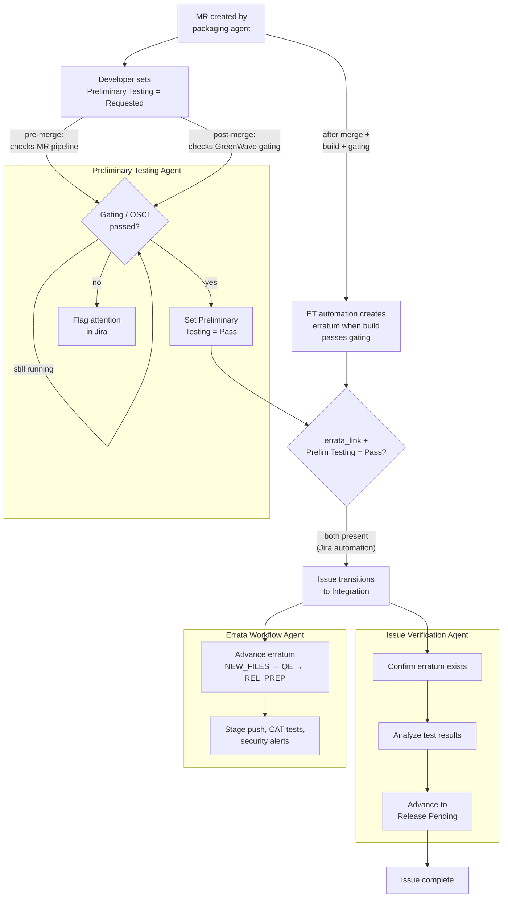
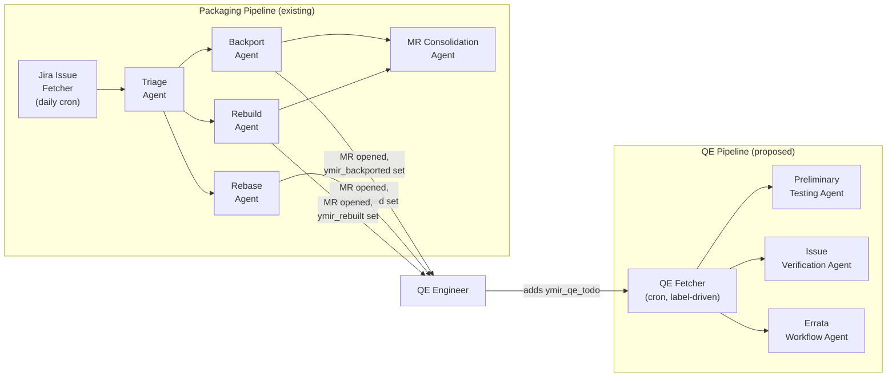

# QE Agents Overview

## Current State

Three QE agents were extracted from the old Supervisor into standalone modules. They are fully independent — no imports from `ymir.supervisor`, use MCP gateway tools, and live under the `agents` compose profile. Each is a **one-shot executor** (takes an env var, processes one item, exits). No trigger mechanism is deployed — they can only be run manually via compose.

The old Supervisor code (`ymir/supervisor/`) is dead code: commented out in `deploy.sh`, not deployed. Source files, OpenShift manifests, Containerfile, CI build job, and Makefile targets still exist in the repo.

| Agent | Source | Input | What it does |
|---|---|---|---|
| **Preliminary Testing** | `ymir/agents/preliminary_testing_agent.py` | `JIRA_ISSUE` | Analyzes GreenWave gating and MR pipeline outcomes. Sets Preliminary Testing Jira field to Pass/Fail. |
| **Issue Verification** | `ymir/agents/issue_verification_agent.py` | `JIRA_ISSUE` | Post-fix lifecycle: tracks MR merge → erratum creation → test analysis → advances issue to Release Pending. |
| **Errata Workflow** | `ymir/agents/errata_workflow_agent.py` | `ERRATUM_ID` | Advances errata through ET states: NEW_FILES → QE → REL_PREP. Handles stage push, CAT tests, security alerts, product listing verification. |

Each agent is **self-routing** — it fetches the issue/erratum, checks preconditions, and decides what to do based on the current state. If there's nothing to do, it exits immediately (Jira/ET API check only, no LLM cost).

### Where QE agents fit in the issue lifecycle

The packaging pipeline (triage → backport/rebase/rebuild) produces a merge request. The QE agents cover the lifecycle from that point onward — starting while the MR is still open and continuing through erratum release:

- **Preliminary Testing Agent** — triggered when a developer sets `Preliminary Testing = Requested` on the Jira issue. This can happen in two flows: **pre-merge** (MR is ready for review, agent checks OSCI pipeline results on the MR) or **post-merge** (build exists in the candidate tag, agent checks GreenWave gating). The agent sets the field to Pass or Fail. Separately, Errata Tool automation creates an erratum and attaches the build once it passes internal gating and is tagged with the `rhel-*-candidate` Brew tag. Once both `errata_link` and `Preliminary Testing = Pass` are present, the issue automatically transitions to Integration (via Jira automation).
- **Issue Verification Agent** — runs **post-merge**: tracks the issue from erratum creation through test analysis, advancing it to Release Pending when tests pass
- **Errata Workflow Agent** — runs **post-merge**: advances the erratum itself through Errata Tool states (NEW_FILES → QE → REL_PREP), handling stage push, CAT tests, and security alerts

The Issue Verification and Errata Workflow agents run in parallel on different objects — one tracks the Jira issue, the other tracks the erratum. However, there is a dependency: the Errata Workflow Agent cannot advance the erratum from QE → REL_PREP until all related Jira issues are set to Release Pending by the Issue Verification Agent.

All three agents re-check periodically if the issue isn't ready yet (e.g. tests still running, erratum not created). Each re-check is a precondition check only — no LLM cost until the agent has real work to do.

Currently these agents are **one-shot only** — each must be invoked manually with `make run-<agent>-standalone JIRA_ISSUE=...`. The proposed integration below adds automated triggering via the `ymir_qe_todo` label.

### Differences compared to Supervisor worth checking

A few checks from the old Supervisor are not replicated in the standalone agents:

| Missing logic | Old location | Impact |
|---|---|---|
| Erratum ownership check and transfer | `erratum_handler.py:302-313` | Errata Workflow Agent doesn't verify bot ownership before acting |
| NEW_FILES guard during issue verification | `issue_handler.py:278-281` | Issue Verification Agent may run LLM testing analysis prematurely (before QE testing begins) |
| Team assignment pre-filter | `collect.py` JQL | Agents process any issue regardless of team assignment |

## Proposed Integration: `ymir_qe_todo` Label as Enabler

A human adds `ymir_qe_todo` once to enable QE processing. The system shepherds the issue through preliminary testing → issue verification → errata advancement over days/weeks until the lifecycle completes.

### Flow

1. **Human adds `ymir_qe_todo`** to a Jira issue.
2. **QE Fetcher** (CronJob, every ~20 min) picks it up, swaps label to `ymir_qe_in_progress`, pushes to agent queues **once**. For issues with `errata_link`, resolves erratum ID and pushes to the errata workflow queue.
3. Agents process the item. Each agent checks its own preconditions (issue status, field values, MR state) and exits immediately if the issue isn't ready — no LLM cost. If not ready yet (e.g. tests still running, MR not merged), they **re-enqueue themselves** with a delay. Issue Verification and Errata Workflow agents already return `WorkflowResult.reschedule_in` for this. Preliminary Testing needs `reschedule_in` added to `PreliminaryTestingResult` for the `tests-running` / `tests-pending` states.

   **Alternative:** instead of pushing to all queues and relying on agent-side prechecks, the fetcher could route based on issue state (e.g. `Preliminary Testing = Requested` → prelim queue, status `Integration` → verification queue). This moves routing logic into the fetcher but avoids unnecessary agent invocations.
4. **Late erratum handling.** If `ymir_qe_todo` is added before an erratum exists, the fetcher has no erratum ID to push to the errata queue. The issue verification agent should detect when an erratum first appears (it already tracks erratum creation as part of its lifecycle) and push to the errata workflow queue at that point. Alternatively, the safety net rescan could re-check for `errata_link` on each pass and push if one appeared, but with a slower feedback loop.
5. When the full lifecycle completes, the last agent swaps the label to `ymir_qe_done`.
6. **Safety net**: Fetcher scans for stale `ymir_qe_in_progress` (no bot activity >24h) and re-enqueues to recover from crashes.

## Required Changes

### New components

1. **QE Fetcher** — CronJob scanning for `ymir_qe_todo` labels + stale `ymir_qe_in_progress` recovery. Resolves erratum IDs from `errata_link`. Similar to the existing Jira Issue Fetcher (`ymir/jira_issue_fetcher/`).

2. **Queue wrappers for agents** — BRPOP loop + re-enqueue-with-delay logic acting on `WorkflowResult.reschedule_in`. A Redis sorted set (like the old Supervisor's `work_queue.py`) or delayed re-push can implement the delay.

3. **OpenShift manifests** — Deployments for the three agents + CronJob for the QE Fetcher.

4. **New labels** in `JiraLabels` enum — `ymir_qe_todo`, `ymir_qe_in_progress`, `ymir_qe_done`, `ymir_qe_errored`. Optionally, granular per-stage labels (e.g. `ymir_prelim_testing`, `ymir_verifying_tests`) for dashboard visibility.

### Agent fixes

5. **Preliminary Testing Agent** — Add `reschedule_in` field to `PreliminaryTestingResult`. Return a delay (e.g. 20 minutes) for `tests-running` and `tests-pending` states so the orchestrator knows to re-enqueue.

6. **Errata Workflow Agent** — Add erratum ownership check and transfer before acting (replicated from old Supervisor `erratum_handler.py:302-313`).

7. **Issue Verification Agent** — Add NEW_FILES guard: skip LLM test analysis if the erratum is still in NEW_FILES state (QE testing hasn't begun yet). Replicated from old Supervisor `issue_handler.py:278-281`.

### Cleanup

8. **Remove dead Supervisor code** — `ymir/supervisor/`, `Containerfile.supervisor`, OpenShift manifests, CI build job, Makefile targets. Migrate `scripts/test_jira_cloud_uat.py` imports.
