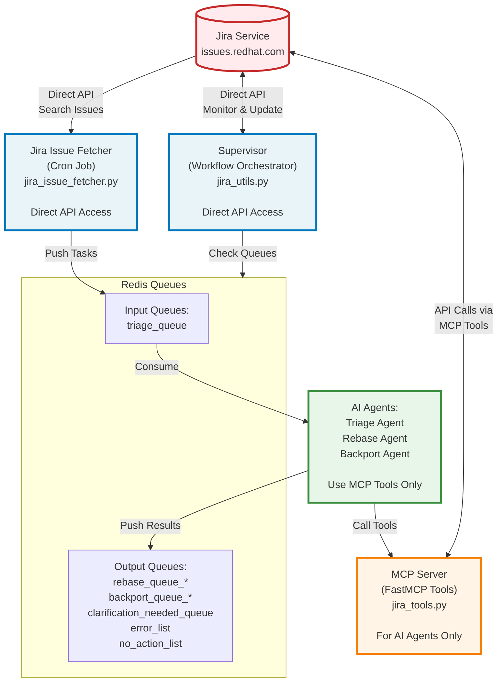
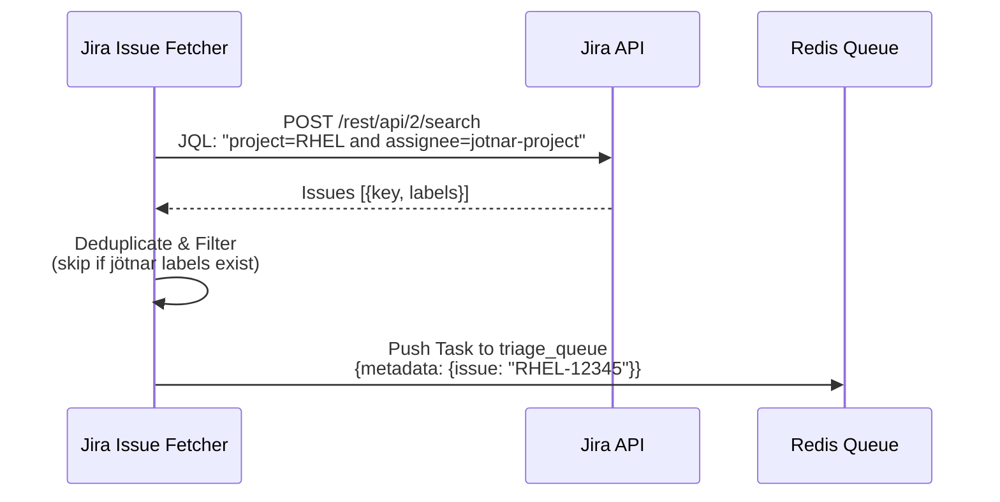
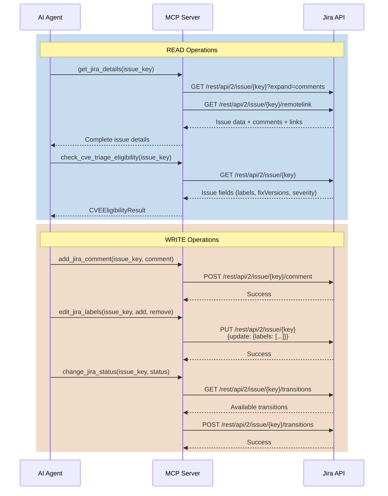
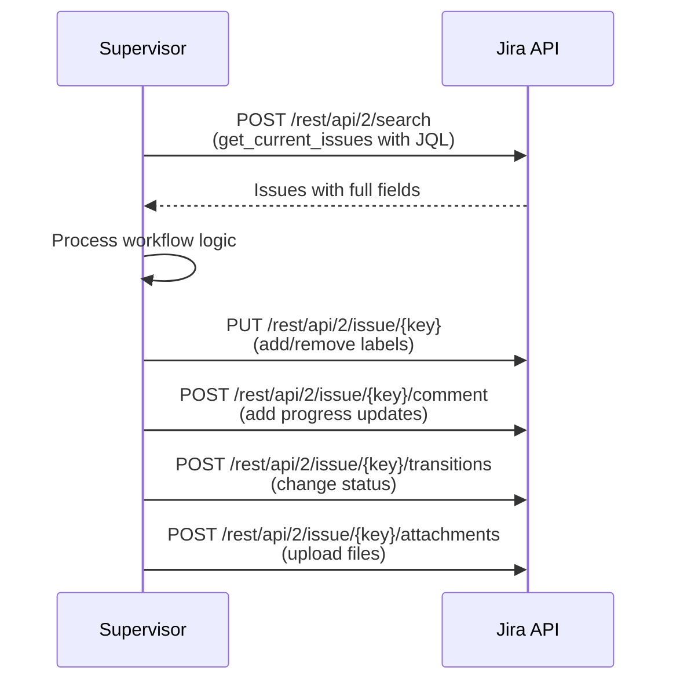
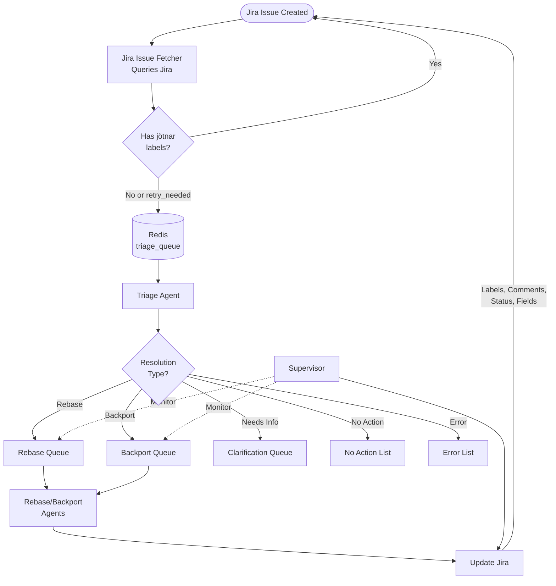

# Jira Data Flow Chart

This document describes the data flow between the AI Workflows system and Jira service.

## System Architecture



**Key Distinctions:**
- **AI Agents** - Use MCP Server tools to access Jira indirectly
- **Python Services** - Direct HTTP API calls to Jira using requests library
- **MCP Server** - Provides controlled FastMCP tools for AI agents only

## Component Types

### AI Agents (Use MCP Server)

These are AI-powered agents that use the MCP Server tools to interact with Jira:
- **Triage Agent** - Analyzes issues, determines if rebase/backport/no-action needed
- **Rebase Agent** - Updates packages to new upstream versions
- **Backport Agent** - Applies specific patches to packages

*These agents access Jira ONLY through MCP tools like `get_jira_details()`, `add_jira_comment()`, etc.*

### Python Services (Direct Jira API Access)

Traditional Python services that make direct HTTP calls to Jira:
- **Jira Issue Fetcher** - Periodic/cron job that queries Jira for assigned issues and pushes them to Redis triage queue. Uses `requests` library for direct API calls.
- **Supervisor** - Workflow orchestration service that monitors issues/errata, advances them through testing/release process. Makes direct API calls using `requests` library via functions like `jira_api_get()`, `jira_api_post()`, `jira_api_put()`.

*These services do NOT use the MCP Server - they call Jira API directly.*

### MCP Server

FastMCP server that provides controlled tools for AI agents:
- Exposes 7 Jira-related tools (see MCP Server Tool Summary below)
- Uses `aiohttp` for async HTTP calls to Jira
- Only used by AI agents, not by Python services

## Data Flow Overview

### 1. Jira Issue Fetcher → Jira (READ)



**Key Features:**
- Pagination: 500 issues/page
- Rate limiting: 5 calls/second
- Exponential backoff on failures
- Deduplication across all Redis queues

### 2. MCP Server Tools → Jira (READ/WRITE)



### 3. Supervisor → Jira (READ/WRITE)



## Complete Workflow



## MCP Server Tool Summary

| Tool | Method | Endpoint | Purpose |
|------|--------|----------|---------|
| **get_jira_details** | GET | `/rest/api/2/issue/{key}` | Fetch issue details, comments, remote links |
| **check_cve_triage_eligibility** | GET | `/rest/api/2/issue/{key}` | Analyze CVE eligibility for triage |
| **verify_issue_author** | GET | `/rest/api/2/user` | Check if author is Red Hat employee |
| **set_jira_fields** | PUT | `/rest/api/2/issue/{key}` | Update fixVersions, severity, target_end |
| **add_jira_comment** | POST | `/rest/api/2/issue/{key}/comment` | Add public/private comment |
| **change_jira_status** | POST | `/rest/api/2/issue/{key}/transitions` | Transition issue status |
| **edit_jira_labels** | PUT | `/rest/api/2/issue/{key}` | Add/remove labels |

## Authentication & Configuration

All components authenticate using:
- **Bearer Token**: `JIRA_TOKEN` environment variable
- **Base URL**: `JIRA_URL` (default: https://issues.redhat.com)
- **Headers**:
  ```json
  {
    "Authorization": "Bearer {JIRA_TOKEN}",
    "Content-Type": "application/json",
    "Accept": "application/json"
  }
  ```

---

**Last Updated:** 2026-03-03
