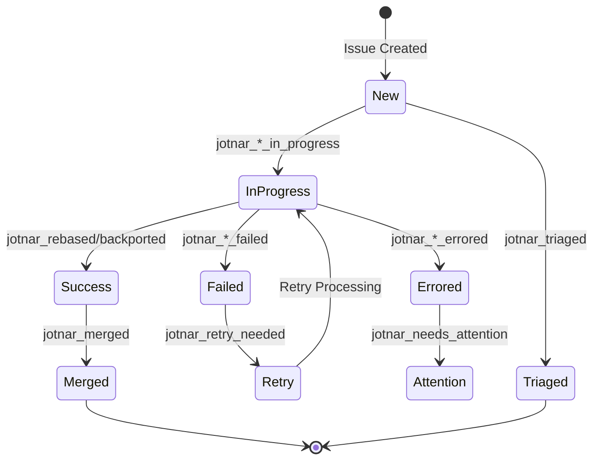
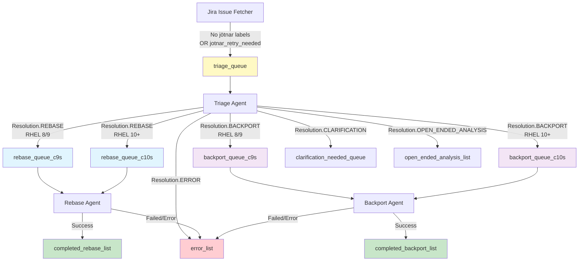
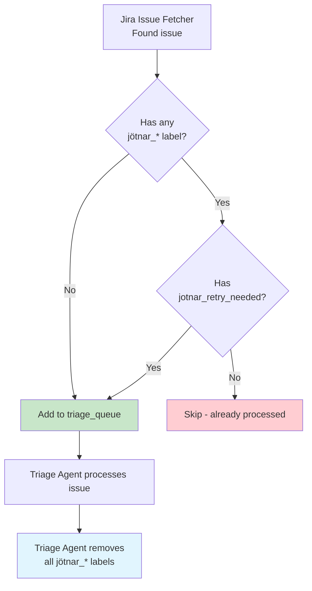

# Jira Label-Based Workflow Routing

This document describes how Jira labels control workflow routing through the processing pipeline.

## Label State Machine

## Redis Queue Routing

## Label Reference

### Status Labels

| Label | Added When | Removed When | Next State |
|-------|------------|--------------|------------|
| `jotnar_rebase_in_progress` | Rebase starts | Rebase completes/fails | `jotnar_rebased` or `jotnar_rebase_failed` |
| `jotnar_backport_in_progress` | Backport starts | Backport completes/fails | `jotnar_backported` or `jotnar_backport_failed` |
| `jotnar_rebased` | Rebase success | Never | `jotnar_merged` |
| `jotnar_backported` | Backport success | Never | `jotnar_merged` |
| `jotnar_merged` | MR merged | Never | Final state |

### Error Labels

| Label | Meaning | Blocks Retry? | Action |
|-------|---------|---------------|--------|
| `jotnar_needs_attention` | Human intervention needed | ✅ Yes | Fix issue, remove label, add `jotnar_retry_needed` |
| `jotnar_triage_errored` | Triage failed | ✅ Yes | Check error_list |
| `jotnar_rebase_errored` | Rebase error | ✅ Yes | Check Jira comment |
| `jotnar_backport_errored` | Backport error | ✅ Yes | Check Jira comment |
| `jotnar_rebase_failed` | Rebase unsuccessful | ❌ No | May auto-retry |
| `jotnar_backport_failed` | Backport unsuccessful | ❌ No | May auto-retry |

### Control Labels

| Label | Purpose | Effect |
|-------|---------|--------|
| `jotnar_retry_needed` | Trigger retry | Forces reprocessing |
| `jotnar_triaged` | Triage completed, no automated follow-up | Terminal state |
| `jotnar_fusa` | Functional Safety | Requires maintainer review |

## Queue Types Summary

| Queue | Type | Triggers | Labels Added | Status |
|-------|------|----------|--------------|--------|
| `triage_queue` | Input | No labels OR retry_needed | - | Active |
| `rebase_queue_c9s` | Input | Resolution=REBASE, RHEL 8/9 | `jotnar_rebase_in_progress` | Active |
| `rebase_queue_c10s` | Input | Resolution=REBASE, RHEL 10+ | `jotnar_rebase_in_progress` | Active |
| `backport_queue_c9s` | Input | Resolution=BACKPORT, RHEL 8/9 | `jotnar_backport_in_progress` | Active |
| `backport_queue_c10s` | Input | Resolution=BACKPORT, RHEL 10+ | `jotnar_backport_in_progress` | Active |
| `rebase_queue` | Input | (Not actively enqueued) | `jotnar_rebase_in_progress` | Legacy (checked for deduplication) |
| `backport_queue` | Input | (Not actively enqueued) | `jotnar_backport_in_progress` | Legacy (checked for deduplication) |
| `clarification_needed_queue` | Input | Resolution=CLARIFICATION | `jotnar_needs_attention` | Active |
| `error_list` | Output | Any error | `jotnar_*_errored` | Active |
| `open_ended_analysis_list` | Output | Resolution=OPEN_ENDED_ANALYSIS | `jotnar_triaged` | Active |
| `completed_rebase_list` | Output | Rebase success | `jotnar_rebased` | Active |
| `completed_backport_list` | Output | Backport success | `jotnar_backported` | Active |

## Deduplication Logic

**Note:** The Jira Issue Fetcher only decides whether to queue an issue for processing based on labels. The actual label cleanup (including removal of `jotnar_retry_needed`) happens in the Triage Agent after it consumes the task from the queue.

---

**Last Updated:** 2026-03-03
