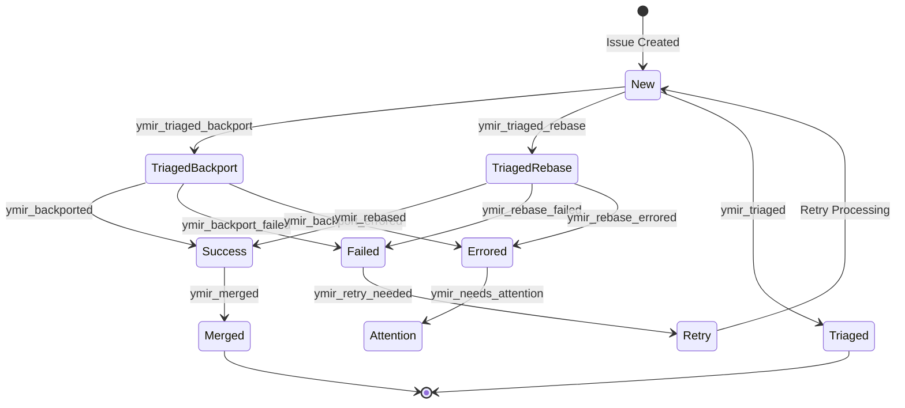
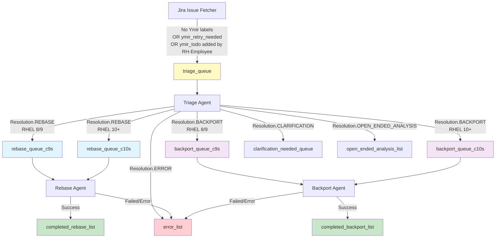
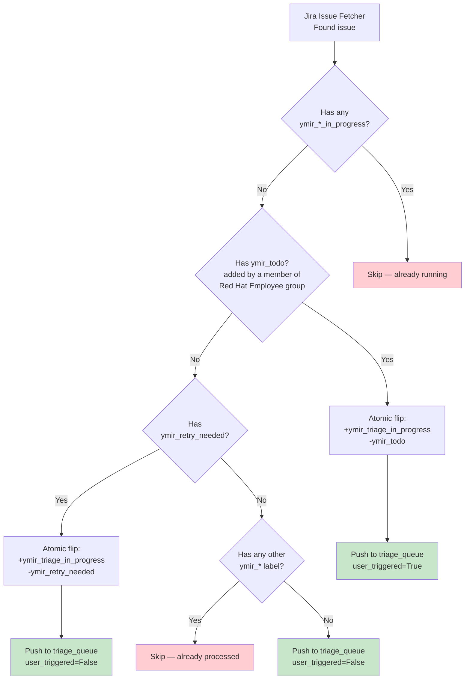

# Jira Label-Based Workflow Routing

This document describes how Jira labels control workflow routing through the processing pipeline.

## Label State Machine

## Redis Queue Routing

## Label Reference

### Status Labels

| Label | Added When | Removed When | Next State |
|-------|------------|--------------|------------|
| `ymir_triaged_rebase` | Triage resolves as rebase | On retry (all labels cleared) | `ymir_rebased` or `ymir_rebase_failed` |
| `ymir_triaged_backport` | Triage resolves as backport | On retry (all labels cleared) | `ymir_backported` or `ymir_backport_failed` |
| `ymir_triaged` | Triage resolves as open-ended-analysis | On retry (all labels cleared) | Terminal state |
| `ymir_rebased` | Rebase success | Never | `ymir_merged` |
| `ymir_backported` | Backport success | Never | `ymir_merged` |
| `ymir_merged` | MR merged | Never | Final state |

### Error Labels

| Label | Meaning | Blocks Retry? | Action |
|-------|---------|---------------|--------|
| `ymir_needs_attention` | Human intervention needed | ✅ Yes | Fix issue, remove label, add `ymir_retry_needed` |
| `ymir_triage_errored` | Triage failed | ✅ Yes | Check error_list |
| `ymir_rebase_errored` | Rebase error | ✅ Yes | Check Jira comment |
| `ymir_backport_errored` | Backport error | ✅ Yes | Check Jira comment |
| `ymir_rebase_failed` | Rebase unsuccessful | ❌ No | May auto-retry |
| `ymir_backport_failed` | Backport unsuccessful | ❌ No | May auto-retry |

### Control Labels

| Label | Purpose | Effect |
|-------|---------|--------|
| `ymir_retry_needed` | Trigger retry | Forces reprocessing |
| `ymir_triaged` | Triage completed, no automated follow-up | Terminal state |
| `ymir_fusa` | Functional Safety | Requires maintainer review |
| `ymir_todo` | Maintainer-facing trigger for an e2e run | Fetcher swaps it for `ymir_triage_in_progress` on enqueue; only honored when the changelog shows the label was added by a member of the `Red Hat Employee` Jira group (verified per-issue, not via JQL). The triage run posts an ack comment and a result comment so the requester gets feedback. Default is silent — without `ymir_todo`, no comments are posted. |

## Queue Types Summary

| Queue | Type | Triggers | Labels Added | Status |
|-------|------|----------|--------------|--------|
| `triage_queue` | Input | No labels OR `ymir_retry_needed` | `ymir_triage_in_progress` (set by fetcher atomic flip for retry/todo, or by agent at triage start for fresh issues) | Active |
| `triage_queue_todo` | Input (priority) | `ymir_todo` | Same as `triage_queue`. The triage agent BRPOPs `[triage_queue_todo, triage_queue]`, so ymir_todo tasks jump ahead of fresh/retry tasks. | Active |
| `rebase_queue_c9s` | Input | Resolution=REBASE, RHEL 8/9 | `ymir_triaged_rebase` | Active (AUTO_CHAIN only) |
| `rebase_queue_c10s` | Input | Resolution=REBASE, RHEL 10+ | `ymir_triaged_rebase` | Active (AUTO_CHAIN only) |
| `backport_queue_c9s` | Input | Resolution=BACKPORT, RHEL 8/9 | `ymir_triaged_backport` | Active (AUTO_CHAIN only) |
| `backport_queue_c10s` | Input | Resolution=BACKPORT, RHEL 10+ | `ymir_triaged_backport` | Active (AUTO_CHAIN only) |
| `rebase_queue` | Input | (Not actively enqueued) | `ymir_triaged_rebase` | Legacy (checked for deduplication) |
| `backport_queue` | Input | (Not actively enqueued) | `ymir_triaged_backport` | Legacy (checked for deduplication) |
| `clarification_needed_queue` | Input | Resolution=CLARIFICATION | `ymir_needs_attention` | Active (AUTO_CHAIN only) |
| `error_list` | Output | Any error | `ymir_*_errored` | Active |
| `open_ended_analysis_list` | Output | Resolution=OPEN_ENDED_ANALYSIS | `ymir_triaged` | Active (AUTO_CHAIN only) |
| `completed_rebase_list` | Output | Rebase success | `ymir_rebased` | Active |
| `completed_backport_list` | Output | Backport success | `ymir_backported` | Active |

## Deduplication Logic

**Trigger labels are consumed by the fetcher, all other labels by the agent.** The fetcher atomically removes `ymir_todo` and `ymir_retry_needed` before pushing to Redis, replacing them with `ymir_triage_in_progress` so the very next sweep sees the in-progress marker and skips. Every other `ymir_*` label is cleaned up by the triage agent when it pops the task. If the fetcher's atomic flip fails after retries, the Redis push is **skipped** — the issue stays eligible for the next sweep with its trigger label intact, rather than being enqueued without a dedup anchor.

## Run Behaviour by Trigger and Flag

Two env-var flags affect pipeline behaviour: `DRY_RUN` and `JIRA_ALLOW_STATUS_CHANGES`. Verbosity is no longer controlled by an env var — the system is silent by default. The only way to opt into comments is per-issue, by adding `ymir_todo` (which flows through the task as `user_triggered=True`).

Ground rules:

- **Default is silent.** No result or error comments are posted on the Jira issue, and intermediate `_failed` labels are not written. Only `not-affected`, `postponed`, `open-ended-analysis`, and `clarification-needed` triage resolutions still post a comment unbidden (those have no MR to look at, so the comment is the only visible explanation).
- **`user_triggered=True`** (set on the task when the issue carried `ymir_todo`) **bypasses every silence filter.** The triage agent posts an immediate private ack comment, posts the result comment, and writes `_failed` labels normally.
- **Labels that are state, not notification, are always written.** `ymir_triage_in_progress` at the start of triage, terminal `ymir_*_errored` / `ymir_triaged_*` at the end. Suppressing them would break dedup against the next fetcher sweep.
- **Jira workflow status changes are opt-in via `JIRA_ALLOW_STATUS_CHANGES`.** When the env var is unset or `false` (the default), the rebase/backport agents do NOT move the issue to "In Progress" on task pop, and the issue-verification agent does NOT transition issues to "Release Pending" / "Closed". When set to `true`, all of those transitions happen. The same flag also gates the preliminary-testing agent setting **`Preliminary Testing = Pass`** — that field admits the build into the next compose, triggers erratum creation, and moves the issue to Integration. Triage and the fetcher never touch the workflow status, regardless of the flag.
- **`DRY_RUN` is read by both fetcher and agent.** On the fetcher, `DRY_RUN=true` skips the atomic Jira label flip (`ymir_todo` / `ymir_retry_needed` are NOT consumed; `ymir_triage_in_progress` is NOT stamped) but the task is still pushed to Redis with the correct `user_triggered` value, so the agent — also presumably in `DRY_RUN` — can exercise its full dry-mode flow. Implication: the trigger label stays on the issue, so every subsequent fetcher sweep re-picks the same issue. That is fine in a test environment; never run a production cron with `DRY_RUN=true`. `DRY_RUN=true` also implies status changes are skipped, independent of `JIRA_ALLOW_STATUS_CHANGES`.

What happens for each trigger state:

| Trigger state at sweep time | Default behaviour | `DRY_RUN=true` |
|---|---|---|
| **No `ymir_*` labels** (fresh issue) | Fetcher pushes to `triage_queue`. Agent stamps `ymir_triage_in_progress`, runs triage, writes a terminal `ymir_*` label. Result comment is suppressed unless the resolution is `not-affected`, `postponed`, `open-ended-analysis`, or `clarification-needed`. If the run auto-chains to rebase or backport, the downstream agent moves the Jira workflow status to "In Progress" when it pops the task — **only if `JIRA_ALLOW_STATUS_CHANGES=true`**; otherwise the status is left untouched. | Agent runs triage but `set_jira_labels` / `add_jira_comment` short-circuit on `DRY_RUN`. No labels, no comment, no MR, no workflow status change. Issue untouched in Jira. |
| **`ymir_todo`** (added by a member of `Red Hat Employee`, no `_in_progress`) | Fetcher verifies the latest `ymir_todo` add in the issue's changelog was performed by a Red Hat Employee; if so, atomically flips `ymir_todo` → `ymir_triage_in_progress` and pushes with `user_triggered=True`. Agent posts a private ack comment and a result comment on completion. `_failed` labels are written normally. Workflow status change is the same as the fresh-issue path (set by rebase/backport on auto-chain, gated on `JIRA_ALLOW_STATUS_CHANGES`). | Fetcher still verifies the author and skips the atomic flip (`ymir_todo` stays on the issue), but still pushes to Redis with `user_triggered=True`. Agent runs in dry mode and writes nothing; workflow status not changed. **Subsequent fetcher sweeps will re-push the same issue** because the trigger label was never consumed. |
| **`ymir_retry_needed`** (no `_in_progress`) | Fetcher atomically flips `ymir_retry_needed` → `ymir_triage_in_progress`, pushes with `user_triggered=False`. Agent runs full triage; behaves exactly like a fresh-issue run (no ack comment, result comment only for the four "no-MR" resolutions). Workflow status change is the same as the fresh-issue path (gated on `JIRA_ALLOW_STATUS_CHANGES`). | Fetcher skips the atomic flip (`ymir_retry_needed` stays on the issue) but still pushes to Redis with `user_triggered=False`. Agent runs in dry mode and writes nothing; workflow status not changed. Subsequent fetcher sweeps will re-push the same issue. |
| **`ymir_todo`** or **`ymir_retry_needed`** **+** any `ymir_*_in_progress` label | Fetcher skips. Not enqueued. Workflow status not affected. | Fetcher skips. Not enqueued. Workflow status not affected. |
| **Any other terminal `ymir_*` label** (e.g. `ymir_triaged_rebase`, `ymir_rebased`, `ymir_triage_errored`) | Fetcher skips. Re-run by adding `ymir_todo` (recommended — produces an ack + result comment) or `ymir_retry_needed`. Workflow status not affected. | Fetcher skips. Workflow status not affected. |

JQL no longer restricts `ymir_todo` by assignee — the fetcher instead verifies per-issue that the user who added the label belongs to the `Red Hat Employee` Jira group by walking the issue's changelog. If the latest `ymir_todo` add was performed by an external collaborator (or the author cannot be verified), the fetcher skips the issue with a warning and does not flip the label.

---

**Last Updated:** 2026-06-10
